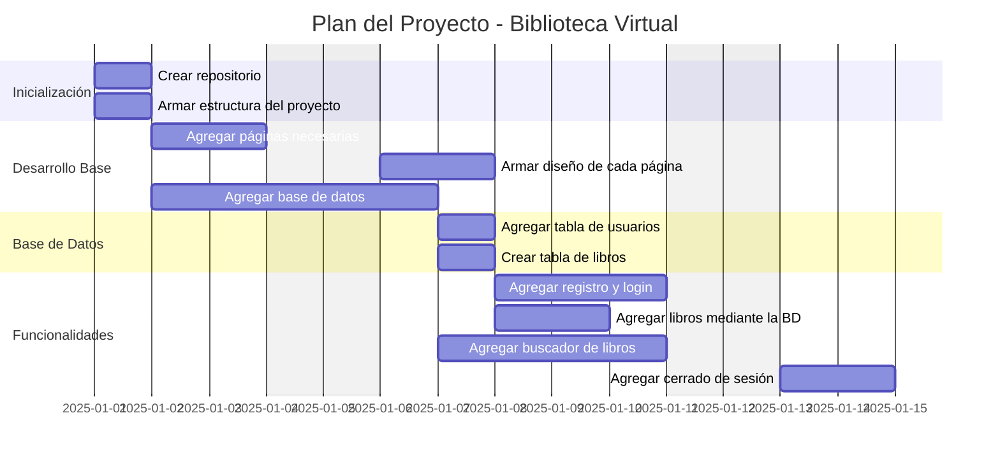

```mermaid
gantt
    title Plan del Proyecto - Biblioteca Virtual
    dateFormat  YYYY-MM-DD
    excludes    weekends

    section Inicialización
    Crear repositorio                :a, 2025-01-01, 1d
    Armar estructura del proyecto    :b, 2025-01-01, 1d

    section Desarrollo Base
    Agregar páginas necesarias       :c, 2025-01-02, 2d
    Armar diseño de cada página      :d, after c, 2d
    Agregar base de datos            :e, after b, 3d

    section Base de Datos
    Agregar tabla de usuarios        :g, after e, 1d
    Crear tabla de libros            :h, after e, 1d

    section Funcionalidades
    Agregar registro y login         :i, after g, 3d
    Agregar libros mediante la BD    :j, after h, 2d
    Agregar buscador de libros       :f, after e, 4d
    Agregar cerrado de sesión        :k, after i, 2d
```
