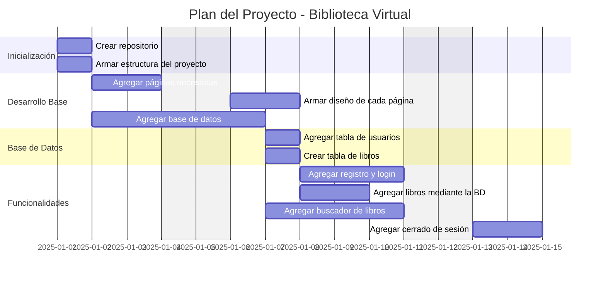
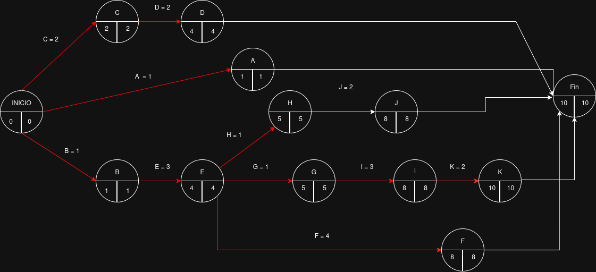

# <p align="center">📚 MONILIOTECA</p>

<p align="center">
  
</p>

<p align="center"><i>“Lecturas que te hacen evolucionar”</i></p>


# 📚 Biblioteca Virtual – Proyecto Escolar

Sistema web de gestión de biblioteca desarrollado con **ASP.NET Core Razor Pages** y **Dapper**, sin uso de Entity Framework.  
Permite a los usuarios registrarse, iniciar sesión y gestionar su propia biblioteca personal a partir de un catálogo general administrado por un usuario **Admin**.

---

## 👥 Equipo de Desarrollo

- **Ezequiel Lizasoain**   
- **Alina Martinez** 

---

## 🛠️ Tecnologías Utilizadas

- C#
- ASP.NET Core Razor Pages
- Dapper
- MariaDB
- Bootstrap
- HTML5
- CSS3
- JavaScript
- Autenticación con Cookies y Claims
- Carga de imágenes en wwwroot
- Modo Claro / Modo Oscuro con JS y CSS Variables

---

## ⚙️ Requisitos Previos

Antes de iniciar el proyecto, asegurarse de tener instalado:

- .NET SDK 7 o superior
- MariaDB
- Visual Studio 2022 o VS Code
- Git

---

## 🗂️ Estructura Importante del Proyecto

```
/Biblioteca
 ├─ /Pages
 ├─ /Models
 ├─ /Data
 ├─ /wwwroot
 │   ├─ /css
 │   ├─ /js
 │   └─ /img/libros
 ├─ /mariaDB
 │   ├─ bd.sql
 │   └─ inserts.sql
 ├─ appsettings.json
```

---

## 🗄️ Configuración de la Base de Datos

### 1️⃣ Crear la base de datos

Ejecutar el archivo:

```
/mariaDB/bd.sql
```

Contenido de `bd.sql`:

```sql
DROP DATABASE IF EXISTS 5to_BiblioRazor;
CREATE DATABASE 5to_BiblioRazor;

USE 5to_BiblioRazor;

CREATE TABLE Rol (
    Id INT AUTO_INCREMENT PRIMARY KEY,
    Nombre VARCHAR(50) NOT NULL
);

CREATE TABLE Usuario (
    Id INT AUTO_INCREMENT PRIMARY KEY,
    Nombre VARCHAR(100) NOT NULL,
    Email VARCHAR(200) NOT NULL UNIQUE,
    PasswordHash VARCHAR(255) NOT NULL,
    RolId INT NOT NULL DEFAULT 2,
    FOREIGN KEY (RolId) REFERENCES Rol(Id)
);

CREATE TABLE CatalogoLibro (
    Id INT AUTO_INCREMENT PRIMARY KEY,
    Titulo VARCHAR(200) NOT NULL,
    Autor VARCHAR(200) NOT NULL,
    Anio INT,
    Descripcion TEXT,
    ImagenUrl VARCHAR(300)
);

CREATE TABLE Libro ( 
    Id INT AUTO_INCREMENT PRIMARY KEY,
    Titulo VARCHAR(200) NOT NULL,
    Autor VARCHAR(200) NOT NULL,
    Anio INT,
    Descripcion TEXT,
    UsuarioId INT,
    ImagenUrl VARCHAR(300),
    FOREIGN KEY (UsuarioId) REFERENCES Usuario(Id)
);
```

---

### 2️⃣ Insertar datos iniciales

Ejecutar el archivo:

```
/mariaDB/inserts.sql
```

Contenido de `inserts.sql`:

```sql
INSERT INTO CatalogoLibro (Titulo, Autor, Anio, Descripcion) VALUES
('El Señor de los Anillos', 'J.R.R. Tolkien', 1954, 'Fantasía épica'),
('1984', 'George Orwell', 1949, 'Distopía política'),
('Cien años de soledad', 'Gabriel García Márquez', 1967, 'Realismo mágico'),
('Don Quijote', 'Miguel de Cervantes', 1605, 'Clásico de la literatura');

INSERT INTO Rol (Nombre) VALUES ('Admin'), ('Usuario');
```

---

### 3️⃣ Configurar la conexión en `appsettings.json`

Editar el archivo `appsettings.json`:

```json
{
  "ConnectionStrings": {
    "DefaultConnection": "Server=localhost;Database=5to_BiblioRazor;User=root;Password=TU_PASSWORD;"
  }
}
```

⚠️ Reemplazar `TU_PASSWORD` por la contraseña real de MariaDB.

  Y tu `TU_USER` por el usuario que tengas

---

## ▶️ Cómo Ejecutar el Proyecto

1. Clonar el repositorio:
   ```bash
   git clone https://github.com/tu-repo/biblioteca.git
   ```

2. Abrir el proyecto en Visual Studio.

3. Restaurar dependencias:
   ```bash
   dotnet restore
   ```

4. Ejecutar el proyecto:
   ```bash
   dotnet run
   ```

5. Acceder desde el navegador:
   ```
   https://localhost:5001
   ```

---

## 🔐 Usuarios y Roles

### Usuario
- Puede registrarse
- Iniciar sesión
- Agregar libros a su biblioteca
- Ver, editar y eliminar sus propios libros

### Admin
- Crea, edita y elimina libros del catálogo general
- Puede subir imágenes de los libros
- Al eliminar un libro también se elimina la imagen física

---

## 🖼️ Gestión de Imágenes

- Las imágenes se guardan en:
  ```
  wwwroot/img/libros/
  ```
- En la base de datos se guarda solo la **ruta**
- Solo el Admin puede subir imágenes
- Al eliminar un libro del catálogo, la imagen también se borra del servidor

---

## 🌙 Modo Claro / Modo Oscuro

- Implementado con JavaScript y CSS Variables
- El tema se guarda en `localStorage`
- Se mantiene al recargar la página
- Botón de cambio de tema en la barra superior

---

## ❌ No se utiliza Entity Framework

Este proyecto utiliza exclusivamente **Dapper** para:

- Consultas SQL
- Inserciones
- Eliminaciones
- Actualizaciones

Esto permite mayor control y mejor rendimiento.

---

## ✅ Estado del Proyecto

- Registro y Login de usuarios
- Autenticación con roles
- Catálogo administrado por Admin
- Biblioteca personal por usuario
- Subida y eliminación de imágenes
- Modo claro / oscuro
- Validaciones básicas

---

## 📋 Lista de Tareas del Proyecto

| Tarea | Descripción                             | Precedencia | Duración |
|-------|-----------------------------------------|-------------|----------|
| A     | Crear repositorio                       | —           | 1 día    |
| B     | Armar estructura del proyecto          | —           | 1 día    |
| C     | Agregar páginas necesarias             | —           | 2 días   |
| D     | Armar el diseño de cada página         | C           | 2 días   |
| E     | Agregar base de datos                  | B           | 3 días   |
| F     | Agregar buscador de libros             | E           | 4 días   |
| G     | Agregar tabla de usuarios              | E           | 1 día    |
| H     | Crear tabla de libros                  | E           | 1 día    |
| I     | Agregar registro de usuario y login    | G           | 3 días   |
| J     | Agregar libros mediante la BD          | H           | 2 días   |
| K     | Agregar cerrado de sesión              | I           | 2 días   |

---



---

## 📋 CPM del proyecto

<p align="center">
  
</p>

---

## 📄 Licencia

Proyecto desarrollado con fines **educativos/escolares**.

---

## ✨ Autoría

Desarrollado por:  
**Ezequiel Lizasoain & Alina Martinez – 2025**
